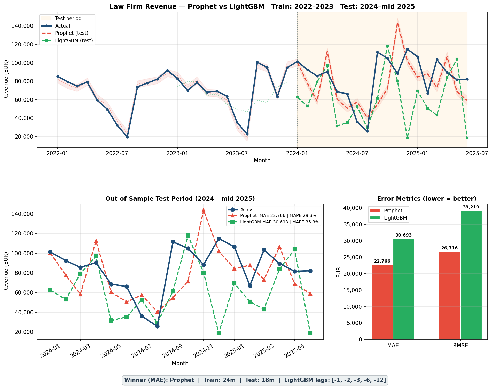

# Law Firm Revenue Forecasting — Prophet vs LightGBM

Revenue forecasting model comparison using 3 years of synthetic law firm data.  
Train: Jan 2022 – Dec 2023 | Test: Jan 2024 – Jun 2025 (out-of-sample)

## Results

| Model | MAE (EUR) | MAPE | RMSE (EUR) |
|-------|-----------|------|------------|
| **Prophet** ✓ | 22,766 | 29.3% | 26,716 |
| LightGBM | 30,693 | 35.3% | 39,219 |

Prophet outperforms LightGBM by 26% on MAE. The dataset has strong yearly seasonality (Greek law firm patterns — summer slump, autumn peak, December spike) which Prophet captures explicitly via multiplicative seasonality.

## Chart

## Files

| File | Description |
|------|-------------|
| `LawFirm_Forecast_AllInOne.py` | Full pipeline — data load, Prophet, LightGBM, chart, Excel report |
| `LawFirm_Synthetic_3Y.xlsx` | Synthetic dataset (42 months, Jan 2022 – Jun 2025) |
| `LawFirm_Forecast_3Y.png` | Forecast comparison chart |

## Stack

Python 3.13 · Prophet · LightGBM · Darts · pandas · matplotlib · openpyxl

## Key Finding

When data has clear yearly seasonal structure and 2+ years of history, Prophet is the better choice over a lag-based ML model.
